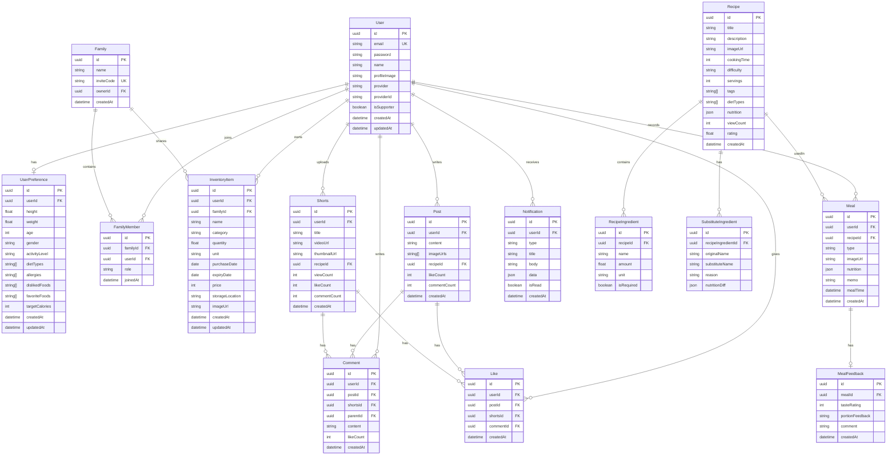

# ERD (Entity Relationship Diagram)

## 엔티티 목록

| 엔티티 | 설명 |
|--------|------|
| User | 사용자 |
| UserPreference | 사용자 선호도 (식단, 신체정보) |
| Family | 가족 그룹 |
| FamilyMember | 가족 구성원 |
| InventoryItem | 재고 아이템 |
| Recipe | 레시피 |
| RecipeIngredient | 레시피 재료 |
| SubstituteIngredient | 대체 재료 |
| Meal | 식사 기록 |
| MealFeedback | 식사 피드백 |
| Post | 라운지 게시글 |
| Shorts | 쇼츠 영상 |
| Comment | 댓글 |
| Like | 좋아요 |
| Notification | 알림 |

---

## ERD 다이어그램



---

## 테이블 상세

### User (사용자)

| 컬럼 | 타입 | 필수 | 설명 |
|------|------|------|------|
| id | UUID | ✅ | PK |
| email | VARCHAR(255) | ✅ | 이메일 (UK) |
| password | VARCHAR(255) | | 비밀번호 (해시) |
| name | VARCHAR(100) | ✅ | 이름 |
| profileImage | VARCHAR(500) | | 프로필 이미지 URL |
| provider | VARCHAR(50) | | OAuth 제공자 (kakao, google, apple) |
| providerId | VARCHAR(255) | | OAuth ID |
| isSupporter | BOOLEAN | ✅ | 서포터즈 여부 (default: false) |
| createdAt | TIMESTAMP | ✅ | 생성일 |
| updatedAt | TIMESTAMP | ✅ | 수정일 |

### UserPreference (사용자 선호도)

| 컬럼 | 타입 | 필수 | 설명 |
|------|------|------|------|
| id | UUID | ✅ | PK |
| userId | UUID | ✅ | FK → User |
| height | DECIMAL(5,2) | | 키 (cm) |
| weight | DECIMAL(5,2) | | 몸무게 (kg) |
| age | INTEGER | | 나이 |
| gender | VARCHAR(10) | | 성별 |
| activityLevel | VARCHAR(20) | | 활동량 (low, medium, high) |
| dietTypes | TEXT[] | | 식단 유형 (diabetes, keto, vegan 등) |
| allergies | TEXT[] | | 알러지 |
| dislikedFoods | TEXT[] | | 싫어하는 음식 |
| favoriteFoods | TEXT[] | | 좋아하는 음식 |
| targetCalories | INTEGER | | 목표 칼로리 |
| createdAt | TIMESTAMP | ✅ | 생성일 |
| updatedAt | TIMESTAMP | ✅ | 수정일 |

### InventoryItem (재고)

| 컬럼 | 타입 | 필수 | 설명 |
|------|------|------|------|
| id | UUID | ✅ | PK |
| userId | UUID | ✅ | FK → User (등록자) |
| familyId | UUID | | FK → Family (공유 시) |
| name | VARCHAR(100) | ✅ | 품목명 |
| category | VARCHAR(50) | ✅ | 카테고리 (채소, 육류, 유제품 등) |
| quantity | DECIMAL(10,2) | ✅ | 수량 |
| unit | VARCHAR(20) | ✅ | 단위 (개, g, ml 등) |
| purchaseDate | DATE | | 구매일 |
| expiryDate | DATE | | 유통기한 |
| price | INTEGER | | 구매가격 (원) |
| storageLocation | VARCHAR(20) | | 보관위치 (냉장, 냉동, 실온) |
| imageUrl | VARCHAR(500) | | 이미지 URL |
| createdAt | TIMESTAMP | ✅ | 생성일 |
| updatedAt | TIMESTAMP | ✅ | 수정일 |

### Recipe (레시피)

| 컬럼 | 타입 | 필수 | 설명 |
|------|------|------|------|
| id | UUID | ✅ | PK |
| title | VARCHAR(200) | ✅ | 레시피 제목 |
| description | TEXT | | 설명 |
| imageUrl | VARCHAR(500) | | 대표 이미지 |
| cookingTime | INTEGER | | 조리시간 (분) |
| difficulty | VARCHAR(20) | | 난이도 (easy, medium, hard) |
| servings | INTEGER | | 인분 |
| tags | TEXT[] | | 태그 |
| dietTypes | TEXT[] | | 적합 식단 (diabetes, keto 등) |
| nutrition | JSONB | | 영양정보 (calories, protein, carbs, fat) |
| viewCount | INTEGER | ✅ | 조회수 (default: 0) |
| rating | DECIMAL(2,1) | | 평점 |
| createdAt | TIMESTAMP | ✅ | 생성일 |

### Meal (식사 기록)

| 컬럼 | 타입 | 필수 | 설명 |
|------|------|------|------|
| id | UUID | ✅ | PK |
| userId | UUID | ✅ | FK → User |
| recipeId | UUID | | FK → Recipe (레시피 사용 시) |
| type | VARCHAR(20) | ✅ | 식사 종류 (breakfast, lunch, dinner, snack) |
| imageUrl | VARCHAR(500) | | 식사 사진 |
| nutrition | JSONB | | AI 분석 영양정보 |
| memo | TEXT | | 메모 |
| mealTime | TIMESTAMP | ✅ | 식사 시간 |
| createdAt | TIMESTAMP | ✅ | 생성일 |

### MealFeedback (식사 피드백)

| 컬럼 | 타입 | 필수 | 설명 |
|------|------|------|------|
| id | UUID | ✅ | PK |
| mealId | UUID | ✅ | FK → Meal |
| tasteRating | INTEGER | ✅ | 맛 평점 (1-5) |
| portionFeedback | VARCHAR(20) | | 양 피드백 (too_little, just_right, too_much) |
| comment | TEXT | | 코멘트 |
| createdAt | TIMESTAMP | ✅ | 생성일 |

---

## 인덱스

```sql
-- User
CREATE UNIQUE INDEX idx_user_email ON "User"(email);
CREATE INDEX idx_user_provider ON "User"(provider, providerId);

-- InventoryItem
CREATE INDEX idx_inventory_user ON "InventoryItem"(userId);
CREATE INDEX idx_inventory_family ON "InventoryItem"(familyId);
CREATE INDEX idx_inventory_expiry ON "InventoryItem"(expiryDate);

-- Recipe
CREATE INDEX idx_recipe_diet_types ON "Recipe" USING GIN(dietTypes);
CREATE INDEX idx_recipe_tags ON "Recipe" USING GIN(tags);

-- Meal
CREATE INDEX idx_meal_user_time ON "Meal"(userId, mealTime);

-- Post
CREATE INDEX idx_post_user ON "Post"(userId);
CREATE INDEX idx_post_created ON "Post"(createdAt DESC);

-- Notification
CREATE INDEX idx_notification_user_read ON "Notification"(userId, isRead);
```
