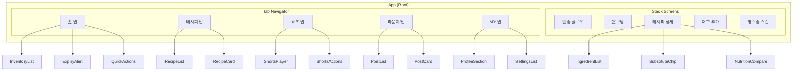

# 프론트엔드 컴포넌트 구조

## 컴포넌트 다이어그램



---

## 공통 컴포넌트 (components/common/)

### Button

```tsx
interface ButtonProps {
  label: string
  onPress: () => void
  variant?: 'primary' | 'secondary' | 'outline' | 'ghost'
  size?: 'sm' | 'md' | 'lg'
  disabled?: boolean
  loading?: boolean
  icon?: ReactNode
  fullWidth?: boolean
}
```

**사용 예시**
```tsx
<Button
  label="영수증 스캔"
  variant="primary"
  icon={<CameraIcon />}
  onPress={handleScan}
/>
```

### Card

```tsx
interface CardProps {
  children: ReactNode
  onPress?: () => void
  padding?: 'none' | 'sm' | 'md' | 'lg'
  shadow?: boolean
}
```

### Input

```tsx
interface InputProps {
  label?: string
  placeholder?: string
  value: string
  onChangeText: (text: string) => void
  type?: 'text' | 'email' | 'password' | 'number'
  error?: string
  disabled?: boolean
  leftIcon?: ReactNode
  rightIcon?: ReactNode
}
```

### Badge

```tsx
interface BadgeProps {
  label: string
  variant?: 'default' | 'success' | 'warning' | 'error' | 'diet'
  size?: 'sm' | 'md'
}
```

**식단 배지 예시**
```tsx
<Badge label="당뇨식단" variant="diet" />
<Badge label="저탄고지" variant="diet" />
<Badge label="D-3" variant="warning" />
```

### Avatar

```tsx
interface AvatarProps {
  imageUrl?: string
  name: string
  size?: 'sm' | 'md' | 'lg' | 'xl'
  showBadge?: boolean  // 서포터즈 배지
}
```

### Modal

```tsx
interface ModalProps {
  visible: boolean
  onClose: () => void
  title?: string
  children: ReactNode
}
```

---

## 재고 컴포넌트 (components/inventory/)

### InventoryCard

```tsx
interface InventoryCardProps {
  item: InventoryItem
  onPress: () => void
  onConsume: (quantity: number) => void
}

// InventoryItem 타입
interface InventoryItem {
  id: string
  name: string
  category: string
  quantity: number
  unit: string
  expiryDate?: string
  daysUntilExpiry?: number
  imageUrl?: string
  storageLocation: 'refrigerator' | 'freezer' | 'room'
}
```

**렌더링**
- 품목 이미지 (없으면 카테고리 아이콘)
- 품목명
- 수량/단위
- 유통기한 배지 (D-N 또는 "만료됨")
- 보관위치 아이콘

### ExpiryBadge

```tsx
interface ExpiryBadgeProps {
  daysUntilExpiry: number
}
```

| 상태 | 색상 | 텍스트 |
|------|------|--------|
| 만료됨 | 빨강 | "만료됨" |
| 3일 이내 | 주황 | "D-N" |
| 7일 이내 | 노랑 | "D-N" |
| 그 외 | 초록 | "D-N" |

### ScannerOverlay

```tsx
interface ScannerOverlayProps {
  onCapture: (imageUri: string) => void
  onClose: () => void
}
```

- 카메라 뷰 오버레이
- 영수증 영역 가이드 프레임
- 촬영 버튼
- 플래시 토글

### CategoryFilter

```tsx
interface CategoryFilterProps {
  categories: string[]
  selected: string | null
  onSelect: (category: string | null) => void
}
```

---

## 레시피 컴포넌트 (components/recipe/)

### RecipeCard

```tsx
interface RecipeCardProps {
  recipe: Recipe
  onPress: () => void
  showMatchRate?: boolean
}

interface Recipe {
  id: string
  title: string
  imageUrl: string
  cookingTime: number
  difficulty: 'easy' | 'medium' | 'hard'
  matchRate?: number
  dietBadges?: string[]
  missingIngredients?: string[]
}
```

**렌더링**
- 레시피 이미지
- 제목
- 조리시간 / 난이도
- 재고 매칭률 (85%)
- 식단 배지들 (당뇨식단, 저탄고지 등)

### IngredientList

```tsx
interface IngredientListProps {
  ingredients: Ingredient[]
  showInventoryStatus?: boolean
}

interface Ingredient {
  name: string
  amount: number
  unit: string
  inInventory?: boolean
  substitute?: SubstituteInfo
}
```

### SubstituteChip

```tsx
interface SubstituteChipProps {
  original: string
  substitute: string
  reason: string
  onPress: () => void
}
```

**예시**: "설탕 → 알룰로스" (당뇨 식단에 적합)

### NutritionCompare

```tsx
interface NutritionCompareProps {
  original: Nutrition
  customized: Nutrition
}

interface Nutrition {
  calories: number
  protein: number
  carbs: number
  fat: number
}
```

두 영양정보 비교 표시 (원본 vs 맞춤형)

### CookingSteps

```tsx
interface CookingStepsProps {
  steps: CookingStep[]
  currentStep: number
  onStepChange: (step: number) => void
}
```

---

## 커뮤니티 컴포넌트 (components/community/)

### PostCard

```tsx
interface PostCardProps {
  post: Post
  onPress: () => void
  onLike: () => void
  onComment: () => void
}

interface Post {
  id: string
  author: {
    id: string
    name: string
    profileImage?: string
    isSupporter: boolean
  }
  content: string
  imageUrls: string[]
  likeCount: number
  commentCount: number
  isLiked: boolean
  createdAt: string
  recipe?: { id: string; title: string }
}
```

### ShortsPlayer

```tsx
interface ShortsPlayerProps {
  shorts: Shorts
  isActive: boolean  // 현재 보이는 쇼츠인지
  onLike: () => void
  onComment: () => void
  onShare: () => void
}

interface Shorts {
  id: string
  author: { name: string; profileImage?: string }
  title: string
  videoUrl: string
  likeCount: number
  commentCount: number
  isLiked: boolean
}
```

- 세로 전체화면 비디오
- 자동 재생/일시정지
- 좋아요/댓글/공유 버튼 (우측)
- 작성자 정보 (하단)

### CommentSection

```tsx
interface CommentSectionProps {
  postId?: string
  shortsId?: string
  comments: Comment[]
  onSubmit: (content: string) => void
}
```

### SupporterBadge

```tsx
interface SupporterBadgeProps {
  size?: 'sm' | 'md'
}
```

서포터즈 뱃지 아이콘 (노랑 별)

---

## 피드백 컴포넌트 (components/feedback/)

### CookingFeedbackModal

```tsx
interface CookingFeedbackModalProps {
  visible: boolean
  mealId: string
  recipeName: string
  onClose: () => void
  onSubmit: (feedback: Feedback) => void
}

interface Feedback {
  tasteRating: number  // 1-5
  portionFeedback: 'too_little' | 'just_right' | 'too_much'
  comment?: string
}
```

**UI 구성**
1. 맛 평가: 별점 5개
2. 양 평가: 3개 버튼 (적었어요 / 적당해요 / 많았어요)
3. 코멘트: 텍스트 입력 (선택)
4. 제출 버튼

### StarRating

```tsx
interface StarRatingProps {
  rating: number
  maxRating?: number
  size?: 'sm' | 'md' | 'lg'
  onChange?: (rating: number) => void
  readonly?: boolean
}
```

---

## 온보딩 컴포넌트 (components/onboarding/)

### BodyInfoForm

```tsx
interface BodyInfoFormProps {
  onSubmit: (data: BodyInfo) => void
}

interface BodyInfo {
  height: number
  weight: number
  age: number
  gender: 'male' | 'female'
  activityLevel: 'low' | 'medium' | 'high'
}
```

### DietPreferenceSelector

```tsx
interface DietPreferenceSelectorProps {
  selected: string[]
  onChange: (selected: string[]) => void
}
```

**식단 옵션**
- 당뇨 식단
- 다이어트
- 저탄고지 (키토)
- 비건
- 락토프리
- 글루텐프리
- 고단백
- 저염식

### FoodSelectionGrid (넷플릭스 스타일)

```tsx
interface FoodSelectionGridProps {
  foods: FoodOption[]
  selected: string[]
  onToggle: (foodId: string) => void
  minSelection?: number
}

interface FoodOption {
  id: string
  name: string
  imageUrl: string
  category: string
}
```

- 음식 이미지 그리드
- 선택하면 체크 오버레이
- "N개 이상 선택해주세요" 안내

---

## 상태 관리 (stores/)

### useAuthStore

```typescript
interface AuthState {
  user: User | null
  accessToken: string | null
  isAuthenticated: boolean

  // Actions
  login: (email: string, password: string) => Promise<void>
  loginWithOAuth: (provider: string, token: string) => Promise<void>
  logout: () => void
  refreshToken: () => Promise<void>
}
```

### useInventoryStore

```typescript
interface InventoryState {
  items: InventoryItem[]
  isLoading: boolean
  filter: InventoryFilter

  // Actions
  fetchItems: () => Promise<void>
  addItem: (item: CreateInventoryDto) => Promise<void>
  updateItem: (id: string, data: Partial<InventoryItem>) => Promise<void>
  deleteItem: (id: string) => Promise<void>
  consumeItem: (id: string, quantity: number) => Promise<void>
  setFilter: (filter: InventoryFilter) => void
}
```

### useUserPreferenceStore

```typescript
interface PreferenceState {
  preference: UserPreference | null
  isOnboardingComplete: boolean

  // Actions
  fetchPreference: () => Promise<void>
  updatePreference: (data: Partial<UserPreference>) => Promise<void>
  completeOnboarding: () => void
}
```

### useFamilyStore

```typescript
interface FamilyState {
  family: Family | null
  members: FamilyMember[]

  // Actions
  createFamily: (name: string) => Promise<void>
  joinFamily: (code: string) => Promise<void>
  leaveFamily: () => Promise<void>
  inviteMember: () => string  // 초대 코드 반환
}
```

---

## 커스텀 훅 (hooks/)

### useCamera

```typescript
function useCamera() {
  const [permission, requestPermission] = useCameraPermission()
  const takePhoto: () => Promise<string>  // 이미지 URI 반환
  const pickFromGallery: () => Promise<string>

  return { permission, requestPermission, takePhoto, pickFromGallery }
}
```

### useOCR

```typescript
function useOCR() {
  const [isProcessing, setIsProcessing] = useState(false)
  const [result, setResult] = useState<OCRResult | null>(null)

  const scanReceipt: (imageUri: string) => Promise<OCRResult>

  return { isProcessing, result, scanReceipt }
}
```

### useRecipeRecommend

```typescript
function useRecipeRecommend() {
  const { data: recipes, isLoading } = useQuery(
    ['recipes', 'recommended'],
    fetchRecommendedRecipes
  )

  return { recipes, isLoading }
}
```

### useExpiry

```typescript
function useExpiry() {
  const expiringItems = useInventoryStore(
    state => state.items.filter(item => item.daysUntilExpiry <= 7)
  )

  const scheduleNotification: (item: InventoryItem) => void

  return { expiringItems, scheduleNotification }
}
```
